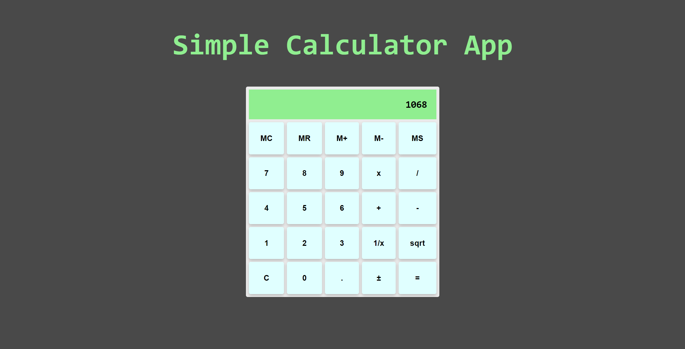

# Calculator Application

# Overview

- Simple calculator application built entirely with HTML, CSS, and vanilla Javascript.
- Calculator allows for continuous calculations as well as memory functionality.

# Website

- See it [here](https://brandonchuck.github.io/Calculator/) on Github Pages! 

# Preview

# Summary

This project allowed me to work on transforming user data into a tabular format for readability and organization. Displaying data in a tabular fashion is a tool used widely throughout the web and important for storing data and abstracting from it. At a surface level, we can extract simple patterns from having a record of our expenses and viewing them in tabular form. In a more technical manner, I enjoyed learning how to programatically generate new rows of data via user form submission.

- Detailed Features:
    - Continuous calculations
    - Memory functions:
      - memory recall (MR)
      - memory add/subtract (M+ & M-)
      - memory store (MS)
    - Square root and inverse functions (sqrt & 1/x)

# Author

Brandon Chuck | Full-Stack Developer | [LinkedIn](https://www.linkedin.com/in/brandonchuck/) | [Personal Website](https://www.brandonchuck-dev.com)
